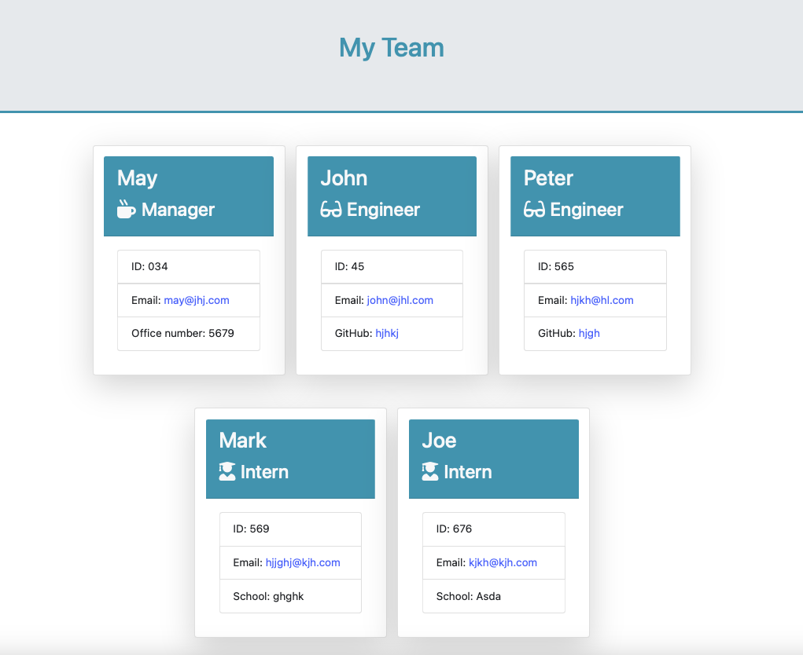
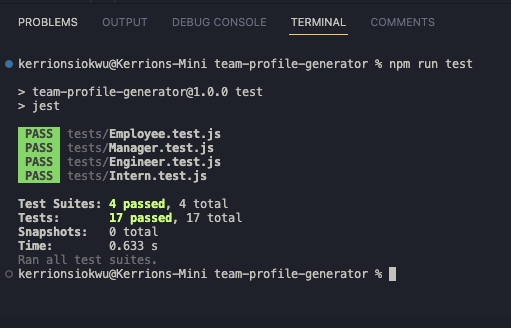

# Team Profile Generator

  
  

  ## Description
  This is a Node CLI application which requests information about the members of a software engineering team and generates an HTML file which displays the information. Each team can consist of a Manager, any  number of Engineers and any number of Interns. The HTML file is styled using Bootstrap, CSS and Font Awesome. The project demonstrates the use of Object Oriented Programming (OOP) and Test Driven Development (TDD) using Jest.

  ## Table of Contents
  * [Technologies](#technologies)
  * [Installation](#installation)
  * [Usage](#usage)
  * [license](#license)
  * [Contributing](#contributing)
  * [Questions](#questions)
  * [Tests](#tests)
  
 
  ## Technologies
  * HTML  
  * CSS  
  * JavaScript  
  * Bootstrap  
  * Node.js  
  * NPM  
  * Jest
  
  ## Installation 
  To ensure a smooth installation of this app, please follow the instructions carefully and in order. Note that this is a command line application, so all commands must be entered in the command line (if on Windows) or Terminal (if on Mac). Before proceeding, please ensure that Node.js and npm are installed on your local computer. [Click](https://docs.npmjs.com/downloading-and-installing-node-js-and-npm) for more information on installation. 
  * Download or clone the Team Profile Generator repository into your local computer. 
  * Create a .gitignore file and include node_modules/ so that your node_modules directory isn't uploaded to GitHub. Make sure to create the .gitignore file before moving to the next step. 
  * Install json package by by entering this command
    ```
      npm init 
    ``` 
  * Install the dependencies by entering the command below in the command line or Terminal
    ```
      npm install 
    ``` 

  ## Usage
  To run the application, open Terminal or the command line and type node index.js. You will be prompted with a series of questions; use the up and down arrow keys to navigate multiple-choice questions and hit the space bar to make a selection before hitting enter. After all questions have been answered, you will be notified that the file has been saved to README.md. Open the file and you will see that your README file has been generated.

  ## Screenshot
  

  ## Demo
  [Click Me](https://drive.google.com/file/d/1BWwmQdLfkAXyHmobS2018yoWewx1jocV/view) or the demo below to see the full walkthrough video of the application.

  [](https://drive.google.com/file/d/1BWwmQdLfkAXyHmobS2018yoWewx1jocV/view)

  ## License
  This project is licensed under the MIT License. [View licence](https://opensource.org/licenses/MIT)

  ## Contributing
  You are welcome to contribute to this project

  ## Questions
  Do you have any questions? Would you like to collaborate on a project?
  * Checkout my [github](https://github.com/ladykays)
  * Send me an [email](mailto:ladykerrion@yahoo.com).

  ## Credit
  * https://gist.github.com/Amitabh-K/ae073eea3d5207efaddffde19b1618e8

  * https://nodejs.org/dist/latest-v18.x/docs/api/fs.html#fspromisesmkdirpath-options

  ## Tests
  
  * To run tests, enter 
    ```
      npm run test 
    ```  
    

